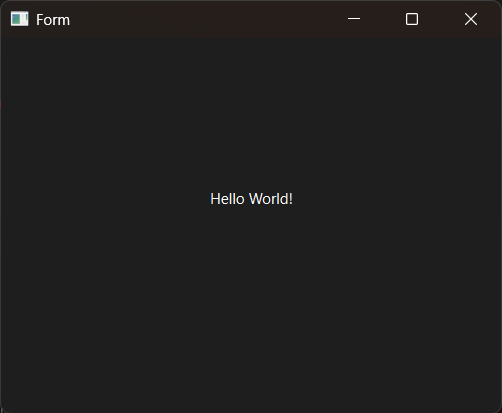

# Introduction

PyQt6 QLabel UI example.


# QT Designer

Windows 11:

```bash
${Python}/Lib/site-packages/qt6_applications/Qt/bin/designer.exe
```

Linux (Ubuntu 22.04):

```bash
${Python}/lib/python3.10/site-packages/qt6_applications/Qt/bin/designer
```


# Screenshot




# Usage

```bash
$ python main.py
```
