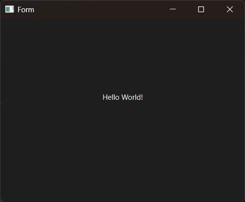

# Introduction

PyQt6 QLabel UI example.


# QT Designer

Windows 11:

```bash
${Python}/Lib/site-packages/qt6_applications/Qt/bin/designer.exe
```

Linux (Ubuntu 22.04):

```bash
${Python}/lib/python3.10/site-packages/qt6_applications/Qt/bin/designer
```


# Screenshot




# Usage

1. Using QT Designer Craete widget window and drag a label control save as "hello.ui" file.

2. Translate UI file:

```bash
$ python -m PyQt6.uic.pyuic hello.ui -o hello_ui.py
```

3. Use

```bash
$ python main.py
```
